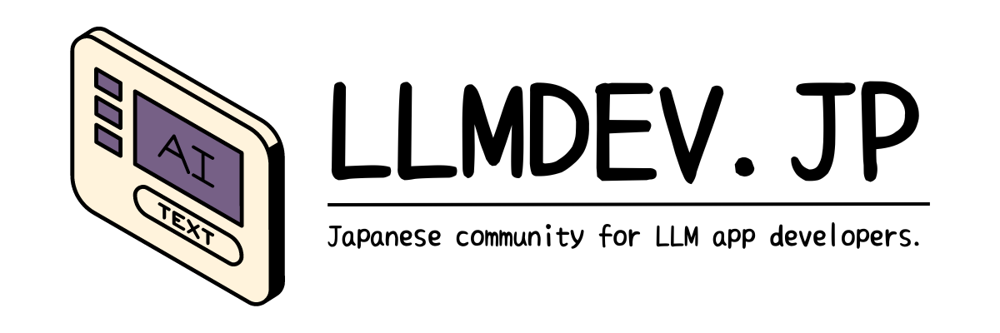

LLMを利用した開発をしている開発者のための日本語コミュニティです。
LLMサービスやツールの情報や、LLMアプリUXについての知見などについて共有・議論しましょう。

## 大切にすること

1. お互いを尊重する
2. 一次情報を大切にする
3. とことん議論する
4. 自分で動かしてみる

## Discord
→ [Discordサーバー](https://discord.gg/neVfeUgs)

### Channels
#### ⁠ようこそ
エントランスです！

#### ⁠運営情報
運営に関するお知らせを流していきます。また、運営についてのご意見やご質問もこちらまで

#### ⁠モデル
LLMモデルについての情報共有や質問相談など。

#### ⁠ベクトルdb
ベクトルDBについての情報共有や質問相談など。

#### ⁠ライブラリ
Langchain などのツールについての情報共有や質問相談など。

#### ⁠設計
LLMに関する設計についての情報共有や質問相談など。

#### イベント
イベント情報などを共有する場所です。

#### サービス・ツール
LLMを使ったサービスを共有する場所です。

#### インフラ
AzureやAWSなどのインフラ系のトピックです。

#### UX
LLMアプリのUXについて議論する場所です。

#### ⁠雑談
雑談です！

#### ⁠活動報告
書いたことや作ったものを共有してみてください！

#### ⁠自己紹介
お気軽に♪

## References
### LLMs
- https://openai.com/blog
- https://learn.microsoft.com/ja-jp/azure/cognitive-services/openai/whats-new
- https://bard.google.com/updates
- https://github.com/hollobit/GenAI_LLM_timeline
- https://huggingface.co/blog
- https://txt.cohere.com/
- https://github.com/Hannibal046/Awesome-LLM

### Tools
- https://github.com/hwchase17/langchain
- https://github.com/jerryjliu/llama_index
- https://github.com/microsoft/guidance
- https://github.com/trending

### Vector DBs
- https://weaviate.io/blog
- https://docs.pinecone.io/docs/release-notes
- https://github.com/qdrant/qdrant
- https://github.com/pgvector/pgvector
- https://github.com/milvus-io/milvus

### Guidelines
- https://learn.microsoft.com/en-us/ai/guidelines-human-ai-interaction/

### Communities
- AIAD https://note.com/23letter/n/n09529f16bf02
- https://chatgpt.connpass.com/
- https://www.chatgpthackers.dev/

### Events
- https://connpass.com/search/?q=LLM&start_from=2023%2F07%2F03&start_to=2024%2F01%2F03

### Notes
- https://github.com/swyxio/ai-notes

### Blogs/News
- https://techcrunch.com/category/artificial-intelligence/
- https://www.latent.space/
- https://www.bensbites.co/
- https://zenn.dev/topics/openai
- https://zenn.dev/topics/chatgpt
- https://zenn.dev/topics/llm
- https://qiita.com/tags/openai
- https://qiita.com/tags/chatgpt
- https://qiita.com/tags/llm
- https://note.com/hashtag/ChatGPT
- https://note.com/search?q=llm&context=note&mode=search
- https://medium.com/tag/chatgpt
- https://medium.com/tag/openai
- https://medium.com/tag/llm

### Related
- https://aws.amazon.com/jp/blogs/news/
- https://cloud.google.com/blog/?hl=en

## Code of conduct
コミュニティの行動規範については、[CODE_OF_CONDUCT.md](./CODE_OF_CONDUCT.md) をご覧ください。
